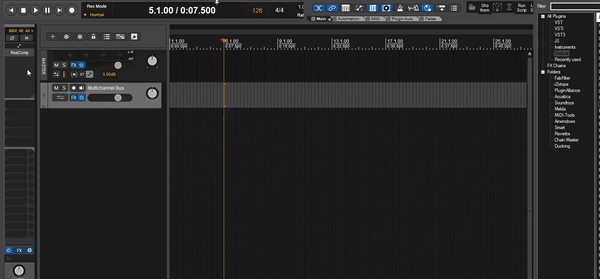

Instructions: Config Flags and Globals on the script. Create a new track in Reaper and select it. Add a new FX and run this script.

To do: Create pop up menu to deal with flags and globals or .ini file.
To do: Multichannel routing and pin mapping (that's probably a different script).

NOTE: Works with VST, VST3. JS not supported yet.

Video Demo:
https://user-images.githubusercontent.com/58243333/161370921-83e8a383-9448-4f96-9281-03df7fe91c00.mp4

